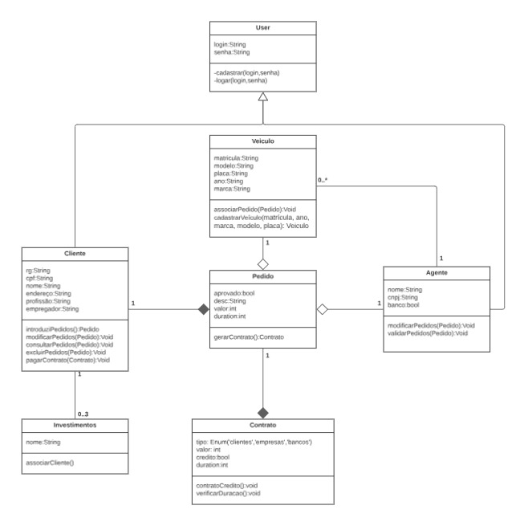
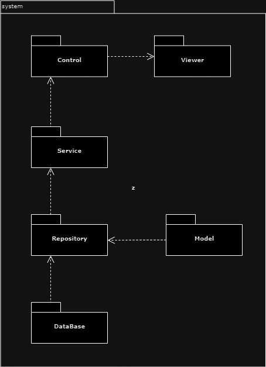

# **ABD Rent System**

## Integrabtes do Grupo

- Ana Flávia
- Bruno Evangelista
- David DIas Pinto

## Histórias de Usuário
### História de Usuário 1: Cadastro de Cliente

**Como** um cliente potencial,
**Eu quero** me cadastrar no sistema,
**Para** que eu possa fazer pedidos de aluguel de automóveis.

*Critérios de Aceitação:*

- O cliente deve fornecer nome completo, e-mail, telefone e CPF para o cadastro.
- O sistema deve enviar um e-mail de confirmação com um link para ativar a conta.
- Após a ativação, o cliente deve poder fazer login no sistema.

### História de Usuário 2: Solicitação de Aluguel

**Como** um cliente registrado,
**Eu quero** solicitar o aluguel de um automóvel,
**Para** que eu possa usar o carro para uma determinada data e período.

*Critérios de Aceitação:*

- O cliente deve selecionar o tipo de carro desejado e o período de aluguel.
- O sistema deve mostrar a disponibilidade do carro para as datas selecionadas.
- O cliente deve poder revisar o valor do aluguel e confirmar a solicitação.
- Após a confirmação, o sistema deve gerar um contrato de aluguel e enviá-lo por e-mail.

### História de Usuário 3: Cancelamento de Aluguel

**Como** um cliente registrado,
**Eu quero** cancelar um pedido de aluguel,
**Para** que eu possa desistir do carro que havia reservado.

*Critérios de Aceitação:*

- O cliente deve poder visualizar todos os pedidos ativos.
- O sistema deve permitir o cancelamento de pedidos com pelo menos 24 horas de antecedência.
- Após o cancelamento, o sistema deve atualizar o status do pedido e enviar uma confirmação por e-mail.

### História de Usuário 4: Modificação de Pedido

**Como** um cliente registrado,
**Eu quero** modificar um pedido de aluguel existente,
**Para** que eu possa alterar a data ou o tipo de carro reservado.

 *Critérios de Aceitação:*

- O cliente deve poder visualizar e editar os detalhes do pedido.
- O sistema deve verificar a disponibilidade do novo carro ou datas alteradas.
- O cliente deve confirmar as mudanças e o sistema atualizar o contrato de aluguel.
- Uma confirmação por e-mail deve ser enviada após a modificação.

### História de Usuário 5: Cadastro de Agente

**Como** um agente de empresa,
**Eu quero** me cadastrar no sistema,
**Para** que eu possa gerenciar os pedidos de aluguel e visualizar os relatórios.

*Critérios de Aceitação:*

- O agente deve fornecer nome da empresa, e-mail e telefone para o cadastro.
- O sistema deve enviar um e-mail de confirmação com um link para ativar a conta do agente.
- Após a ativação, o agente deve poder fazer login e acessar o painel de controle.

### História de Usuário 6: Gerenciamento de Pedidos

**Como** um agente de empresa,
**Eu quero** gerenciar os pedidos de aluguel,
**Para** que eu possa aprovar, cancelar ou modificar os pedidos conforme necessário.

 *Critérios de Aceitação:*

- O agente deve poder visualizar todos os pedidos recebidos.
- O sistema deve permitir a aprovação ou o cancelamento de pedidos.
- O agente deve poder modificar detalhes do pedido, como status ou datas.
- O sistema deve atualizar automaticamente o status do pedido e enviar notificações por e-mail ao cliente.

## Tecnologias Utilizadas

- Spring Boot
- React
- Mantine ( Dá Ponto Extra ) 
- Vercel

## Diagrama de Classes UML

## DIagrama de Casos de Uso

## Diagrama de Pacotes

